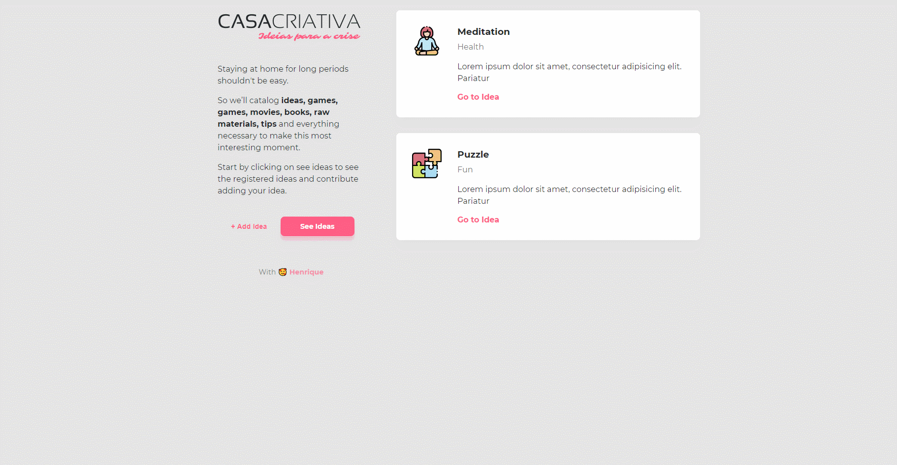

<h4 align="center">
  A simple webapp to add ideas to do during quarantine
</h4>


<p align="center">
  <a href="#rocket-technologies">Technologies</a>&nbsp;&nbsp;&nbsp;|&nbsp;&nbsp;&nbsp;
  <a href="#information_source-how-to-use">How To Use</a>&nbsp;&nbsp;&nbsp;|&nbsp;&nbsp;&nbsp;
  <a href="#memo-license">License</a>
</p>

<p align="center">
  
</p>

## :rocket: Technologies

This project was developed with the following technologies:

-  [HTML5](https://www.w3schools.com/html/)
-  [CSS3](https://www.w3schools.com/html/)
-  [NodeJS](https://nodejs.org/en/)


## :information_source: How To Use

To clone and run this application, you'll need [Git](https://git-scm.com), [Node.js v10.16][nodejs] or higher + [Yarn v1.13][yarn] or higher installed on your computer and the [GoBarber API](https://github.com/lukemorales/gobarber-api). From your command line:

```bash
# Clone this repository
$ git clone https://github.com/henriquecampaner/idea-house


# Install dependencies
$ yarn install

# Run the app
$ yarn dev
```

## :memo: License
This project is under the MIT license.

---

Made with ♥ by Henrique Campaner :wave:

[nodejs]: https://nodejs.org/
[yarn]: https://yarnpkg.com/
[vc]: https://code.visualstudio.com/
[vceditconfig]: https://marketplace.visualstudio.com/items?itemName=EditorConfig.EditorConfig
[vceslint]: https://marketplace.visualstudio.com/items?itemName=dbaeumer.vscode-eslint
